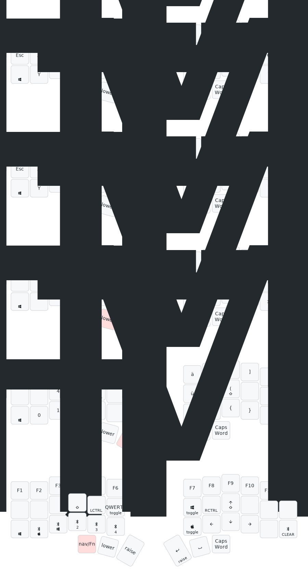

# ZMK Config For My Corne Keyboard

This is the ZMK config for my corne keyboard which I use both on my Mac and on my Windows PC. Both are used with a german keyboad layout.

To get the same keyboard layout on macOS and Windows some changes are required. I have solved this by implementing different layers for each OS which can be toggled on the `nav_fn` layer.

